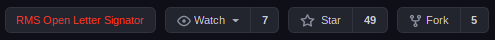

# RMS Open Letter Signatories Highlighter

A chrome extension to add a notice to repositories from anyone who has signed the RMS Open Letter of support.

## Installation

Clone the repository and [install as an "unpacked extension"](https://webkul.com/blog/how-to-install-the-unpacked-extension-in-chrome/)

## Manually Update List of Signatories

You can use [the Python spider](https://github.com/ZaMaZaN4iK/rms-letter-spider) to scrape an updated list of signatories at any time. This list should replace the `githubUsernames` list in `content.js`

